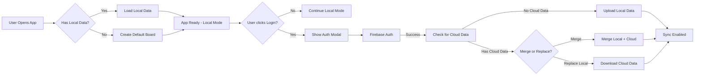

# Cloud Sync Architecture for Drawink

This document outlines the architecture for implementing cloud sync in Drawink while maintaining a **local-first** approach. The goal is to allow users to use the app without login (fully local), while enabling cloud sync and multi-workspace features for authenticated users.

---

## 📋 Overview

### Design Philosophy: Local-First

Drawink follows a **local-first** approach:

1. **Anonymous users** (not logged in): Full functionality with localStorage persistence
2. **Authenticated users**: Full local functionality PLUS cloud sync and workspaces

| Feature | Anonymous User | Authenticated User |
|---------|---------------|-------------------|
| Create/Edit boards | ✅ | ✅ |
| Multiple boards | ✅ | ✅ |
| Local persistence | ✅ | ✅ |
| Cloud sync | ❌ | ✅ |
| Multiple workspaces | ❌ | ✅ |
| Access from any device | ❌ | ✅ |
| Real-time collaboration | ✅ (existing) | ✅ (existing) |

---

## 🏗️ Current Architecture (Baseline)

### Existing Components

| Component | Location | Purpose |
|-----------|----------|---------|
| `LocalData` | `drawink-app/data/LocalData.ts` | Local board persistence |
| `BoardsAPI` | `packages/drawink/types.ts` | Interface for board operations |
| `boardsAPIAtom` | `packages/drawink/atoms/boards.ts` | Jotai atom for boards API |
| `firebase.ts` | `drawink-app/data/firebase.ts` | Firebase integration (files, collab scenes) |
| `json-server` | `json-server/src/index.ts` | Hono backend for shareable links |

### Current Data Flow

```
User → Jotai Atoms → LocalData → localStorage/IndexedDB
                                  ↳ drawink-boards
                                  ↳ drawink-board-{id}-elements
                                  ↳ drawink-board-{id}-state
```

### Existing Firebase Usage

Firebase is currently used for:
- **Collaboration scenes**: Storing encrypted scene data for real-time rooms (`scenes` collection)
- **Files storage**: Uploading images/files for sharing
- **Shareable links**: Binary blob storage via json-server → Firestore

---

## 🗂️ New Data Model

### Entity Relationship Diagram

```
┌─────────────────────────────────────────────────────────────────┐
│                           Cloud (Firestore)                      │
├─────────────────────────────────────────────────────────────────┤
│                                                                  │
│  ┌──────────┐     ┌─────────────────┐     ┌──────────────────┐ │
│  │  users   │────<│ workspace_members│>────│   workspaces     │ │
│  └──────────┘     └─────────────────┘     └──────────────────┘ │
│       │                                          │              │
│       │           ┌──────────────────────────────┘              │
│       │           │                                              │
│       │           ▼                                              │
│       │     ┌──────────┐     ┌─────────────────┐               │
│       │     │  boards  │────<│  board_content  │               │
│       │     └──────────┘     └─────────────────┘               │
│       │                                                          │
│       ▼                                                          │
│  ┌──────────────┐                                               │
│  │ user_settings│ (sync preferences, theme, etc.)               │
│  └──────────────┘                                               │
│                                                                  │
└─────────────────────────────────────────────────────────────────┘
                              │
                              │ Sync
                              ▼
┌─────────────────────────────────────────────────────────────────┐
│                        Local (Browser)                           │
├─────────────────────────────────────────────────────────────────┤
│                                                                  │
│  localStorage:                IndexedDB:                         │
│  ├─ drawink-user              ├─ files-db                       │
│  ├─ drawink-workspaces        └─ library-db                     │
│  ├─ drawink-current-workspace                                   │
│  ├─ drawink-boards                                              │
│  ├─ drawink-current-board-id                                    │
│  ├─ drawink-board-{id}-elements                                 │
│  ├─ drawink-board-{id}-state                                    │
│  └─ drawink-sync-state                                          │
│                                                                  │
└─────────────────────────────────────────────────────────────────┘
```

### Database Schema

#### `users` Collection
```typescript
interface User {
  id: string;              // Firebase Auth UID
  email: string;
  name: string;
  photoUrl?: string;
  createdAt: Timestamp;
  lastLoginAt: Timestamp;
}
```

#### `workspaces` Collection
```typescript
interface Workspace {
  id: string;              // Auto-generated
  ownerUserId: string;     // References users.id
  name: string;
  createdAt: Timestamp;
  updatedAt: Timestamp;
  // Denormalized for quick access
  memberCount: number;
}
```

#### `workspace_members` Subcollection (workspaces/{id}/members)
```typescript
interface WorkspaceMember {
  userId: string;          // References users.id
  role: 'owner' | 'admin' | 'editor' | 'viewer';
  joinedAt: Timestamp;
}
```

#### `boards` Subcollection (workspaces/{workspaceId}/boards)
```typescript
interface CloudBoard {
  id: string;
  name: string;
  createdAt: Timestamp;
  updatedAt: Timestamp;
  createdBy: string;       // userId
  // Sync metadata
  localVersion: number;    // Client's version
  serverVersion: number;   // Server's authoritative version
}
```

#### `board_content` Subcollection (workspaces/{workspaceId}/boards/{boardId}/content)
```typescript
interface BoardContent {
  // Only one document per board: "current"
  elementsJSON: string;    // Stringified elements array
  appStateJSON: string;    // Stringified appState (cleaned)
  updatedAt: Timestamp;
  updatedBy: string;       // userId
  version: number;         // Incremented on each update
  checksum: string;        // For conflict detection
}
```

---

## 🔄 Architecture Layers

### Layer Diagram

```
┌─────────────────────────────────────────────────────────────────┐
│                     UI Layer (React Components)                  │
│                    BoardsMenu, App, Drawink                      │
└─────────────────────────────────┬───────────────────────────────┘
                                  │
                                  ▼
┌─────────────────────────────────────────────────────────────────┐
│                    State Layer (Jotai Atoms)                     │
│  boardsAtom, currentBoardIdAtom, workspacesAtom, userAtom       │
│  syncStatusAtom, authStateAtom                                   │
└─────────────────────────────────┬───────────────────────────────┘
                                  │
                                  ▼
┌─────────────────────────────────────────────────────────────────┐
│                  Storage Adapter Layer (NEW)                     │
│                     HybridStorageAdapter                         │
│  ┌─────────────────┐                   ┌─────────────────────┐  │
│  │LocalStorageAdapter│                 │ CloudStorageAdapter │  │
│  │(always active)   │                  │(if authenticated)   │  │
│  └─────────────────┘                   └─────────────────────┘  │
└─────────────────────────────────┬───────────────────────────────┘
                                  │
                   ┌──────────────┴──────────────┐
                   │                             │
                   ▼                             ▼
┌──────────────────────────┐    ┌────────────────────────────────┐
│     Local Storage        │    │       Cloud Backend            │
│  - localStorage          │    │  - Firebase Firestore          │
│  - IndexedDB             │    │  - Firebase Storage            │
└──────────────────────────┘    └────────────────────────────────┘
```

---

## 🔐 Authentication Layer

### Auth Flow



### Firebase Auth Integration

```typescript
// New file: drawink-app/data/auth.ts
import { 
  getAuth, 
  signInWithPopup, 
  GoogleAuthProvider,
  signOut,
  onAuthStateChanged,
  type User as FirebaseUser
} from 'firebase/auth';

export interface AuthState {
  isAuthenticated: boolean;
  user: FirebaseUser | null;
  isLoading: boolean;
}

// Jotai atom for auth state
export const authStateAtom = atom<AuthState>({
  isAuthenticated: false,
  user: null,
  isLoading: true,
});

// Auth actions
export const loginWithGoogleAtom = atom(null, async (get, set) => {
  const auth = getAuth();
  const provider = new GoogleAuthProvider();
  const result = await signInWithPopup(auth, provider);
  // Auth state will be updated via onAuthStateChanged listener
  return result.user;
});

export const logoutAtom = atom(null, async (get, set) => {
  const auth = getAuth();
  await signOut(auth);
  // Clear cloud data from local, keep local boards
});
```

---

## 📦 Storage Adapter Layer

### Interface Definition

```typescript
// New file: packages/drawink/storage/types.ts

export interface StorageAdapter {
  // Board operations
  getBoards(): Promise<Board[]>;
  createBoard(name: string): Promise<string>;
  updateBoard(id: string, data: Partial<Board>): Promise<void>;
  deleteBoard(id: string): Promise<void>;
  getCurrentBoardId(): Promise<string | null>;
  setCurrentBoardId(id: string): Promise<void>;
  
  // Board content operations
  getBoardContent(boardId: string): Promise<BoardContent>;
  saveBoardContent(boardId: string, content: BoardContent): Promise<void>;
  
  // Workspace operations (cloud only)
  getWorkspaces?(): Promise<Workspace[]>;
  createWorkspace?(name: string): Promise<string>;
  switchWorkspace?(id: string): Promise<void>;
}

export interface BoardContent {
  elements: DrawinkElement[];
  appState: Partial<AppState>;
  version?: number;
  updatedAt?: number;
}
```

### LocalStorageAdapter (Existing, Refactored)

```typescript
// Refactored from: drawink-app/data/LocalData.ts

export class LocalStorageAdapter implements StorageAdapter {
  private getCurrentWorkspace(): string {
    // For local mode, there's always a single "local" workspace
    return 'local';
  }

  async getBoards(): Promise<Board[]> {
    const boards = localStorage.getItem(STORAGE_KEYS.LOCAL_STORAGE_BOARDS);
    return boards ? JSON.parse(boards) : [];
  }

  async createBoard(name: string): Promise<string> {
    const boards = await this.getBoards();
    const newBoard: Board = {
      id: randomId(),
      name,
      createdAt: Date.now(),
      lastModified: Date.now(),
    };
    boards.push(newBoard);
    localStorage.setItem(STORAGE_KEYS.LOCAL_STORAGE_BOARDS, JSON.stringify(boards));
    return newBoard.id;
  }

  async getBoardContent(boardId: string): Promise<BoardContent> {
    const elementsKey = `drawink-board-${boardId}-elements`;
    const stateKey = `drawink-board-${boardId}-state`;
    
    const elements = JSON.parse(localStorage.getItem(elementsKey) || '[]');
    const appState = JSON.parse(localStorage.getItem(stateKey) || '{}');
    
    return { elements, appState };
  }

  async saveBoardContent(boardId: string, content: BoardContent): Promise<void> {
    const elementsKey = `drawink-board-${boardId}-elements`;
    const stateKey = `drawink-board-${boardId}-state`;
    
    localStorage.setItem(elementsKey, JSON.stringify(content.elements));
    localStorage.setItem(stateKey, JSON.stringify(content.appState));
  }

  // ... other methods
}
```

### CloudStorageAdapter (New)

```typescript
// New file: drawink-app/data/CloudStorageAdapter.ts

export class CloudStorageAdapter implements StorageAdapter {
  private userId: string;
  private currentWorkspaceId: string | null = null;

  constructor(userId: string) {
    this.userId = userId;
  }

  async getWorkspaces(): Promise<Workspace[]> {
    const firestore = getFirestore();
    const workspacesRef = collection(firestore, 'workspaces');
    const q = query(
      workspacesRef, 
      where('memberIds', 'array-contains', this.userId)
    );
    const snapshot = await getDocs(q);
    return snapshot.docs.map(doc => ({ id: doc.id, ...doc.data() } as Workspace));
  }

  async getBoards(): Promise<Board[]> {
    if (!this.currentWorkspaceId) {
      throw new Error('No workspace selected');
    }
    
    const firestore = getFirestore();
    const boardsRef = collection(
      firestore, 
      'workspaces', 
      this.currentWorkspaceId, 
      'boards'
    );
    const snapshot = await getDocs(boardsRef);
    return snapshot.docs.map(doc => ({ id: doc.id, ...doc.data() } as Board));
  }

  async getBoardContent(boardId: string): Promise<BoardContent> {
    const firestore = getFirestore();
    const contentRef = doc(
      firestore,
      'workspaces',
      this.currentWorkspaceId!,
      'boards',
      boardId,
      'content',
      'current'
    );
    
    const snapshot = await getDoc(contentRef);
    if (!snapshot.exists()) {
      return { elements: [], appState: {} };
    }
    
    const data = snapshot.data();
    return {
      elements: JSON.parse(data.elementsJSON || '[]'),
      appState: JSON.parse(data.appStateJSON || '{}'),
      version: data.version,
      updatedAt: data.updatedAt?.toMillis(),
    };
  }

  async saveBoardContent(boardId: string, content: BoardContent): Promise<void> {
    const firestore = getFirestore();
    const contentRef = doc(
      firestore,
      'workspaces',
      this.currentWorkspaceId!,
      'boards',
      boardId,
      'content',
      'current'
    );
    
    await setDoc(contentRef, {
      elementsJSON: JSON.stringify(content.elements),
      appStateJSON: JSON.stringify(content.appState),
      updatedAt: serverTimestamp(),
      updatedBy: this.userId,
      version: increment(1),
    }, { merge: true });
  }

  // ... other methods
}
```

### HybridStorageAdapter (New - Main Interface)

```typescript
// New file: drawink-app/data/HybridStorageAdapter.ts

export class HybridStorageAdapter implements StorageAdapter {
  private localAdapter: LocalStorageAdapter;
  private cloudAdapter: CloudStorageAdapter | null = null;
  private syncEngine: SyncEngine | null = null;

  constructor() {
    this.localAdapter = new LocalStorageAdapter();
  }

  /**
   * Enable cloud sync for authenticated user
   */
  enableCloudSync(userId: string): void {
    this.cloudAdapter = new CloudStorageAdapter(userId);
    this.syncEngine = new SyncEngine(this.localAdapter, this.cloudAdapter);
    this.syncEngine.start();
  }

  /**
   * Disable cloud sync (on logout)
   */
  disableCloudSync(): void {
    this.syncEngine?.stop();
    this.syncEngine = null;
    this.cloudAdapter = null;
  }

  /**
   * Check if cloud sync is enabled
   */
  isCloudSyncEnabled(): boolean {
    return this.cloudAdapter !== null;
  }

  // Board operations - always read local first, sync in background
  async getBoards(): Promise<Board[]> {
    // Always read from local for instant response
    const localBoards = await this.localAdapter.getBoards();
    
    // If cloud sync is enabled, trigger background sync
    if (this.syncEngine) {
      this.syncEngine.syncBoards().catch(console.error);
    }
    
    return localBoards;
  }

  async createBoard(name: string): Promise<string> {
    // Create locally first
    const boardId = await this.localAdapter.createBoard(name);
    
    // Sync to cloud in background
    if (this.syncEngine) {
      this.syncEngine.syncNewBoard(boardId).catch(console.error);
    }
    
    return boardId;
  }

  async getBoardContent(boardId: string): Promise<BoardContent> {
    // Load local first for instant display
    const localContent = await this.localAdapter.getBoardContent(boardId);
    
    // Sync with cloud in background
    if (this.syncEngine) {
      this.syncEngine.syncBoardContent(boardId).catch(console.error);
    }
    
    return localContent;
  }

  async saveBoardContent(boardId: string, content: BoardContent): Promise<void> {
    // Save locally first (instant)
    await this.localAdapter.saveBoardContent(boardId, content);
    
    // Sync to cloud in background (debounced)
    if (this.syncEngine) {
      this.syncEngine.scheduleBoardContentSync(boardId);
    }
  }

  // Workspace operations (cloud only)
  async getWorkspaces(): Promise<Workspace[]> {
    if (!this.cloudAdapter) {
      // Return a single "Local" workspace for non-authenticated users
      return [{
        id: 'local',
        name: 'Local Workspace',
        ownerUserId: 'local',
        createdAt: 0,
        updatedAt: Date.now(),
      }];
    }
    return this.cloudAdapter.getWorkspaces();
  }
}
```

---

## 🔄 Sync Engine

### Sync Strategy

The sync engine follows an **eventual consistency** model with **last-write-wins** conflict resolution.

```typescript
// New file: drawink-app/data/SyncEngine.ts

export type SyncStatus = 'idle' | 'syncing' | 'error' | 'offline';

export interface SyncState {
  status: SyncStatus;
  lastSyncAt: number | null;
  pendingChanges: number;
  error: string | null;
}

export class SyncEngine {
  private localAdapter: LocalStorageAdapter;
  private cloudAdapter: CloudStorageAdapter;
  private syncInterval: NodeJS.Timeout | null = null;
  private pendingSyncs: Map<string, ReturnType<typeof debounce>> = new Map();
  
  // Sync state observable
  private _state: SyncState = {
    status: 'idle',
    lastSyncAt: null,
    pendingChanges: 0,
    error: null,
  };

  constructor(local: LocalStorageAdapter, cloud: CloudStorageAdapter) {
    this.localAdapter = local;
    this.cloudAdapter = cloud;
  }

  /**
   * Start automatic background sync
   */
  start(): void {
    // Initial sync
    this.fullSync();
    
    // Periodic sync every 30 seconds
    this.syncInterval = setInterval(() => {
      this.fullSync();
    }, 30000);
    
    // Sync on visibility change (tab becomes active)
    document.addEventListener('visibilitychange', () => {
      if (!document.hidden) {
        this.fullSync();
      }
    });
    
    // Sync before unload
    window.addEventListener('beforeunload', () => {
      this.flushPendingSyncs();
    });
  }

  /**
   * Stop sync engine
   */
  stop(): void {
    if (this.syncInterval) {
      clearInterval(this.syncInterval);
      this.syncInterval = null;
    }
    this.flushPendingSyncs();
  }

  /**
   * Full sync: boards list + current board content
   */
  async fullSync(): Promise<void> {
    this._state.status = 'syncing';
    
    try {
      await this.syncBoards();
      const currentBoardId = await this.localAdapter.getCurrentBoardId();
      if (currentBoardId) {
        await this.syncBoardContent(currentBoardId);
      }
      
      this._state.status = 'idle';
      this._state.lastSyncAt = Date.now();
      this._state.error = null;
    } catch (error) {
      this._state.status = 'error';
      this._state.error = error instanceof Error ? error.message : 'Sync failed';
      console.error('Sync failed:', error);
    }
  }

  /**
   * Sync boards list between local and cloud
   */
  async syncBoards(): Promise<void> {
    const localBoards = await this.localAdapter.getBoards();
    const cloudBoards = await this.cloudAdapter.getBoards();
    
    // Create maps for easy lookup
    const localMap = new Map(localBoards.map(b => [b.id, b]));
    const cloudMap = new Map(cloudBoards.map(b => [b.id, b]));
    
    // Boards only in local → upload to cloud
    for (const [id, board] of localMap) {
      if (!cloudMap.has(id)) {
        await this.cloudAdapter.createBoard(board.name);
        const content = await this.localAdapter.getBoardContent(id);
        await this.cloudAdapter.saveBoardContent(id, content);
      }
    }
    
    // Boards only in cloud → download to local
    for (const [id, board] of cloudMap) {
      if (!localMap.has(id)) {
        await this.localAdapter.createBoardWithId(id, board.name);
        const content = await this.cloudAdapter.getBoardContent(id);
        await this.localAdapter.saveBoardContent(id, content);
      }
    }
    
    // Boards in both → sync based on lastModified
    for (const [id, localBoard] of localMap) {
      const cloudBoard = cloudMap.get(id);
      if (cloudBoard) {
        if (localBoard.lastModified > cloudBoard.updatedAt) {
          // Local is newer → push to cloud
          const content = await this.localAdapter.getBoardContent(id);
          await this.cloudAdapter.saveBoardContent(id, content);
        } else if (cloudBoard.updatedAt > localBoard.lastModified) {
          // Cloud is newer → pull to local
          const content = await this.cloudAdapter.getBoardContent(id);
          await this.localAdapter.saveBoardContent(id, content);
        }
      }
    }
  }

  /**
   * Sync specific board content
   */
  async syncBoardContent(boardId: string): Promise<void> {
    const [localContent, cloudContent] = await Promise.all([
      this.localAdapter.getBoardContent(boardId),
      this.cloudAdapter.getBoardContent(boardId),
    ]);
    
    const localVersion = localContent.version || 0;
    const cloudVersion = cloudContent.version || 0;
    
    if (localVersion > cloudVersion) {
      // Local is newer → push
      await this.cloudAdapter.saveBoardContent(boardId, localContent);
    } else if (cloudVersion > localVersion) {
      // Cloud is newer → pull
      await this.localAdapter.saveBoardContent(boardId, cloudContent);
      
      // Dispatch event for UI to update
      window.dispatchEvent(new CustomEvent('drawink-sync-update', {
        detail: { boardId, content: cloudContent }
      }));
    }
    // If versions are equal, no sync needed
  }

  /**
   * Schedule debounced sync for board content
   */
  scheduleBoardContentSync(boardId: string): void {
    if (!this.pendingSyncs.has(boardId)) {
      this.pendingSyncs.set(
        boardId,
        debounce(async () => {
          await this.syncBoardContent(boardId);
          this.pendingSyncs.delete(boardId);
        }, 2000) // 2 second debounce
      );
    }
    this.pendingSyncs.get(boardId)!();
    this._state.pendingChanges++;
  }

  /**
   * Flush all pending syncs immediately
   */
  flushPendingSyncs(): void {
    for (const [, syncFn] of this.pendingSyncs) {
      syncFn.flush();
    }
  }
}
```

---

## 🎯 Jotai Atoms (Updated)

### New Atoms for Cloud Sync

```typescript
// Updated: packages/drawink/atoms/boards.ts

// === Auth State ===
export const authStateAtom = atom<AuthState>({
  isAuthenticated: false,
  user: null,
  isLoading: true,
});

// === Cloud Sync State ===
export const syncStatusAtom = atom<SyncStatus>('idle');
export const lastSyncAtom = atom<number | null>(null);
export const cloudEnabledAtom = atom<boolean>(false);

// === Workspace State (Cloud Only) ===
export const workspacesAtom = atom<Workspace[]>([]);
export const currentWorkspaceIdAtom = atom<string | null>(null);
export const currentWorkspaceAtom = atom((get) => {
  const workspaces = get(workspacesAtom);
  const currentId = get(currentWorkspaceIdAtom);
  return workspaces.find(w => w.id === currentId) || null;
});

// === Storage Adapter ===
export const storageAdapterAtom = atom<HybridStorageAdapter | null>(null);

// === Actions ===

// Login action
export const loginAtom = atom(null, async (get, set) => {
  const user = await signInWithGoogle();
  set(authStateAtom, { isAuthenticated: true, user, isLoading: false });
  
  const adapter = get(storageAdapterAtom);
  adapter?.enableCloudSync(user.uid);
  set(cloudEnabledAtom, true);
  
  // Trigger initial sync
  set(refreshBoardsAtom);
});

// Logout action
export const logoutAtom = atom(null, async (get, set) => {
  await signOut();
  set(authStateAtom, { isAuthenticated: false, user: null, isLoading: false });
  
  const adapter = get(storageAdapterAtom);
  adapter?.disableCloudSync();
  set(cloudEnabledAtom, false);
  set(workspacesAtom, []);
  set(currentWorkspaceIdAtom, null);
});

// Switch workspace action (cloud only)
export const switchWorkspaceAtom = atom(
  null,
  async (get, set, workspaceId: string) => {
    const adapter = get(storageAdapterAtom);
    if (!adapter) return;
    
    await adapter.setCurrentWorkspace(workspaceId);
    set(currentWorkspaceIdAtom, workspaceId);
    
    // Reload boards for new workspace
    set(refreshBoardsAtom);
  }
);
```

---

## 🖥️ UI Components

### Login Button in MainMenu

```tsx
// New component: packages/drawink/components/main-menu/CloudSync.tsx

export const CloudSyncMenuItem = () => {
  const { t } = useI18n();
  const authState = useAtomValue(authStateAtom);
  const syncStatus = useAtomValue(syncStatusAtom);
  const login = useSetAtom(loginAtom);
  const logout = useSetAtom(logoutAtom);

  if (authState.isLoading) {
    return null;
  }

  if (!authState.isAuthenticated) {
    return (
      <DropdownMenuItem
        icon={CloudIcon}
        onSelect={login}
        data-testid="login-button"
      >
        {t("buttons.loginForCloudSync")}
      </DropdownMenuItem>
    );
  }

  return (
    <>
      <DropdownMenuItem
        icon={UserIcon}
        data-testid="user-info"
      >
        {authState.user?.displayName || authState.user?.email}
      </DropdownMenuItem>
      <DropdownMenuItem
        icon={getSyncIcon(syncStatus)}
        disabled
      >
        {getSyncStatusText(syncStatus, t)}
      </DropdownMenuItem>
      <DropdownMenuItem
        icon={LogoutIcon}
        onSelect={logout}
      >
        {t("buttons.logout")}
      </DropdownMenuItem>
    </>
  );
};
```

### Workspace Selector (Cloud Only)

```tsx
// New component: packages/drawink/components/WorkspaceSelector.tsx

export const WorkspaceSelector = () => {
  const workspaces = useAtomValue(workspacesAtom);
  const currentWorkspace = useAtomValue(currentWorkspaceAtom);
  const switchWorkspace = useSetAtom(switchWorkspaceAtom);
  const cloudEnabled = useAtomValue(cloudEnabledAtom);
  
  // Don't render if cloud is not enabled
  if (!cloudEnabled) {
    return null;
  }

  return (
    <Select
      value={currentWorkspace?.id}
      onValueChange={switchWorkspace}
    >
      {workspaces.map((workspace) => (
        <SelectItem key={workspace.id} value={workspace.id}>
          {workspace.name}
        </SelectItem>
      ))}
    </Select>
  );
};
```

### Sync Status Indicator

```tsx
// New component: packages/drawink/components/SyncStatusIndicator.tsx

export const SyncStatusIndicator = () => {
  const syncStatus = useAtomValue(syncStatusAtom);
  const lastSync = useAtomValue(lastSyncAtom);
  const cloudEnabled = useAtomValue(cloudEnabledAtom);
  
  if (!cloudEnabled) {
    return null;
  }

  return (
    <div className="sync-status">
      {syncStatus === 'syncing' && <SpinnerIcon />}
      {syncStatus === 'idle' && <CheckIcon />}
      {syncStatus === 'error' && <ErrorIcon />}
      {syncStatus === 'offline' && <OfflineIcon />}
      
      {lastSync && (
        <span className="last-sync">
          Last synced: {formatRelativeTime(lastSync)}
        </span>
      )}
    </div>
  );
};
```

---

## 📁 File Structure (New/Modified Files)

```
drawink-app/
├── data/
│   ├── LocalData.ts          # Refactored → LocalStorageAdapter
│   ├── CloudStorageAdapter.ts     # NEW
│   ├── HybridStorageAdapter.ts    # NEW
│   ├── SyncEngine.ts              # NEW
│   ├── auth.ts                    # NEW
│   └── firebase.ts                # Modified (add auth)
└── App.tsx                        # Modified (init auth listener)

packages/drawink/
├── atoms/
│   ├── boards.ts                  # Modified (add sync atoms)
│   └── auth.ts                    # NEW
├── components/
│   ├── main-menu/
│   │   └── CloudSync.tsx          # NEW
│   ├── WorkspaceSelector.tsx      # NEW
│   ├── SyncStatusIndicator.tsx    # NEW
│   └── BoardsMenu.tsx             # Modified (workspace support)
└── storage/
    └── types.ts                   # NEW (interfaces)

firebase-project/
├── firestore.rules                # Modified (auth rules)
└── firestore.indexes.json         # Modified (indexes for queries)
```

---

## 🔒 Security Rules

### Firestore Rules

```javascript
// firebase-project/firestore.rules
rules_version = '2';
service cloud.firestore {
  match /databases/{database}/documents {
    
    // Users collection
    match /users/{userId} {
      allow read, write: if request.auth != null && request.auth.uid == userId;
    }
    
    // Workspaces collection
    match /workspaces/{workspaceId} {
      // Allow read if user is a member
      allow read: if request.auth != null && 
        request.auth.uid in resource.data.memberIds;
      
      // Allow create if authenticated
      allow create: if request.auth != null;
      
      // Allow update/delete if owner
      allow update, delete: if request.auth != null && 
        request.auth.uid == resource.data.ownerUserId;
      
      // Boards subcollection
      match /boards/{boardId} {
        allow read, write: if request.auth != null && 
          request.auth.uid in get(/databases/$(database)/documents/workspaces/$(workspaceId)).data.memberIds;
        
        // Board content subcollection
        match /content/{contentId} {
          allow read, write: if request.auth != null && 
            request.auth.uid in get(/databases/$(database)/documents/workspaces/$(workspaceId)).data.memberIds;
        }
      }
      
      // Members subcollection
      match /members/{memberId} {
        allow read: if request.auth != null && 
          request.auth.uid in get(/databases/$(database)/documents/workspaces/$(workspaceId)).data.memberIds;
        allow write: if request.auth != null && 
          request.auth.uid == get(/databases/$(database)/documents/workspaces/$(workspaceId)).data.ownerUserId;
      }
    }
    
    // Existing scenes collection for collaboration (unchanged)
    match /scenes/{sceneId} {
      allow get, write: if true;
      allow list: if false;
    }
  }
}
```

---

## 📊 Implementation Phases

### Phase 1: Foundation (Week 1-2)
- [ ] Create `StorageAdapter` interface
- [ ] Refactor `LocalData` to `LocalStorageAdapter`
- [ ] Create `HybridStorageAdapter` skeleton
- [ ] Add Firebase Auth integration
- [ ] Add login/logout UI components

### Phase 2: Cloud Storage (Week 3-4)
- [ ] Create `CloudStorageAdapter` with Firestore
- [ ] Implement workspace CRUD operations
- [ ] Implement board sync to cloud
- [ ] Add Firestore security rules

### Phase 3: Sync Engine (Week 5-6)
- [ ] Implement `SyncEngine` with debounced sync
- [ ] Add conflict detection (version-based)
- [ ] Add offline detection
- [ ] Add sync status UI indicators

### Phase 4: Polish & Testing (Week 7-8)
- [ ] First-login flow (merge vs replace)
- [ ] Workspace management UI
- [ ] Error handling & retry logic
- [ ] Performance optimization
- [ ] E2E testing

---

## 🔧 Migration Strategy

### For Existing Users

When an existing user logs in for the first time:

1. **Detect existing local data**
2. **Show merge dialog**:
   - "Merge with cloud" - Upload local boards to cloud
   - "Replace local" - Delete local, use cloud only
   - "Keep both" - Local remains as-is, cloud is separate

```tsx
const FirstLoginDialog = () => (
  <Dialog>
    <h2>Welcome to Drawink Cloud!</h2>
    <p>We found existing boards on this device.</p>
    
    <Button onClick={mergeWithCloud}>
      Upload to Cloud
    </Button>
    <Button onClick={replaceWithCloud}>
      Start Fresh with Cloud
    </Button>
    <Button onClick={keepBoth}>
      Keep Local Separate
    </Button>
  </Dialog>
);
```

---

## 📝 Summary

This architecture achieves:

1. **✅ Local-First**: App works fully offline, no login required
2. **✅ Instant Load**: Always loads from local cache first
3. **✅ Progressive Sync**: Cloud sync happens in background
4. **✅ Multi-Workspace**: Authenticated users get workspaces
5. **✅ Multi-Device**: Cloud data accessible from anywhere
6. **✅ Conflict Resolution**: Version-based last-write-wins
7. **✅ Backward Compatible**: No breaking changes for existing users
8. **✅ Future-Ready**: Can add real-time collaboration per-board

The key insight is the **Storage Adapter pattern** which abstracts the storage layer, allowing the UI to remain unchanged while supporting both local and cloud storage.

---

## 🔍 Existing Auth/Identity Related Code Analysis

This section documents all **existing code** in the Drawink codebase that relates to authentication, identity, or user management. Understanding these will help integrate proper authentication.

### 1. Collaboration Username System

The app already has a **username system** for real-time collaboration, which can be leveraged for cloud sync.

#### Location: `drawink-app/data/localStorage.ts`

```typescript
// Already exists - Saves username to localStorage
export const saveUsernameToLocalStorage = (username: string) => {
  try {
    localStorage.setItem(
      STORAGE_KEYS.LOCAL_STORAGE_COLLAB,  // "drawink-collab"
      JSON.stringify({ username }),
    );
  } catch (error: any) {
    console.error(error);
  }
};

// Already exists - Loads username from localStorage
export const importUsernameFromLocalStorage = (): string | null => {
  try {
    const data = localStorage.getItem(STORAGE_KEYS.LOCAL_STORAGE_COLLAB);
    if (data) {
      return JSON.parse(data).username;
    }
  } catch (error: any) {
    console.error(error);
  }
  return null;
};
```

**How to extend**: Modify `STORAGE_KEYS.LOCAL_STORAGE_COLLAB` to store more user data:
```typescript
// Extended version
interface CollabUserData {
  username: string;
  // New fields for cloud sync
  userId?: string;           // Firebase Auth UID
  email?: string;
  photoUrl?: string;
  isAuthenticated?: boolean;
}
```

---

### 2. Collab State with Username

The `Collab.tsx` component manages username state for collaboration.

#### Location: `drawink-app/collab/Collab.tsx`

```typescript
interface CollabState {
  errorMessage: string | null;
  dialogNotifiedErrors: Record<string, boolean>;
  username: string;                    // ← Already stores username
  activeRoomLink: string | null;
}

// Constructor initializes from localStorage
constructor(props: CollabProps) {
  this.state = {
    // ...
    username: importUsernameFromLocalStorage() || "",  // ← Reads saved username
  };
}
```

**CollabAPI Interface** already exposes username methods:
```typescript
export interface CollabAPI {
  // ...existing methods
  setUsername: CollabInstance["setUsername"];   // ← Already exists
  getUsername: CollabInstance["getUsername"];   // ← Already exists
  // ...
}
```

**How to extend**: Add user ID and auth status:
```typescript
export interface CollabAPI {
  // Existing
  setUsername: (username: string) => void;
  getUsername: () => string;
  
  // NEW for cloud sync
  getUserId?: () => string | null;
  isAuthenticated?: () => boolean;
  setUserData?: (data: UserData) => void;
}
```

---

### 3. Firebase Integration (Already Exists)

Firebase is already initialized and used for collaboration.

#### Location: `drawink-app/data/firebase.ts`

```typescript
// Firebase app initialization (already exists)
let FIREBASE_CONFIG: Record<string, any>;
try {
  FIREBASE_CONFIG = JSON.parse(import.meta.env.VITE_APP_FIREBASE_CONFIG);
} catch (error: any) {
  FIREBASE_CONFIG = {};
}

let firebaseApp: ReturnType<typeof initializeApp> | null = null;
let firestore: ReturnType<typeof getFirestore> | null = null;
let firebaseStorage: ReturnType<typeof getStorage> | null = null;

const _initializeFirebase = () => {
  if (!firebaseApp) {
    firebaseApp = initializeApp(FIREBASE_CONFIG);
  }
  return firebaseApp;
};

const _getFirestore = () => {
  if (!firestore) {
    firestore = getFirestore(_initializeFirebase());
  }
  return firestore;
};
```

**Currently Missing**: Firebase Auth import. Need to add:
```typescript
// Add to firebase.ts
import { 
  getAuth, 
  signInWithPopup, 
  GoogleAuthProvider,
  signOut,
  onAuthStateChanged,
  type User as FirebaseUser 
} from 'firebase/auth';

let auth: ReturnType<typeof getAuth> | null = null;

const _getAuth = () => {
  if (!auth) {
    auth = getAuth(_initializeFirebase());
  }
  return auth;
};

export const firebaseAuth = {
  getAuth: _getAuth,
  signInWithGoogle: async () => {
    const auth = _getAuth();
    const provider = new GoogleAuthProvider();
    return signInWithPopup(auth, provider);
  },
  signOut: async () => {
    const auth = _getAuth();
    return signOut(auth);
  },
  onAuthStateChanged: (callback: (user: FirebaseUser | null) => void) => {
    const auth = _getAuth();
    return onAuthStateChanged(auth, callback);
  },
};
```

---

### 4. Existing Cookie-Based Auth Check

There's a commented-out system for "Excalidraw Plus" auth.

#### Location: `drawink-app/app_constants.ts`

```typescript
export const COOKIES = {
  AUTH_STATE_COOKIE: "excplus-auth",   // ← Legacy Excalidraw Plus
} as const;

// Checks if user is signed in to Excalidraw Plus
export const isDrawinkPlusSignedUser = document.cookie.includes(
  COOKIES.AUTH_STATE_COOKIE,
);
```

**How to extend**: Replace with Firebase Auth state:
```typescript
// Replace cookie check with Firebase Auth
export const COOKIES = {
  AUTH_STATE_COOKIE: "drawink-auth",  // Rename
} as const;

// Don't use cookie check - use Firebase Auth state instead
// The `authStateAtom` Jotai atom will be the source of truth
```

---

### 5. ShareDialog with Username Entry

The ShareDialog already has a username input field.

#### Location: `drawink-app/share/ShareDialog.tsx`

```tsx
const ActiveRoomDialog = ({ collabAPI, activeRoomLink, handleClose }) => {
  return (
    <>
      <h3>Live Collaboration</h3>
      <TextField
        defaultValue={collabAPI.getUsername()}   // ← Uses existing username
        placeholder="Your name"
        label="Your name"
        onChange={collabAPI.setUsername}         // ← Saves username
        onKeyDown={(event) => event.key === KEYS.ENTER && handleClose()}
      />
      {/* ... */}
    </>
  );
};
```

**How to extend**: Pre-fill with authenticated user's name:
```tsx
const ActiveRoomDialog = ({ collabAPI, authState }) => {
  const [username, setUsername] = useState(
    authState.user?.displayName || collabAPI.getUsername() || ""
  );
  
  return (
    <TextField
      defaultValue={username}
      disabled={authState.isAuthenticated}  // Pre-filled from auth
      // ...
    />
  );
};
```

---

### 6. Main Menu Login Placeholder

There's commented-out code for a login button in the main menu.

#### Location: `drawink-app/components/AppMainMenu.tsx`

```tsx
// COMMENTED OUT - but shows the intended pattern
{/* <MainMenu.ItemLink
  icon={loginIcon}
  href={`${import.meta.env.VITE_APP_PLUS_APP}${
    isDrawinkPlusSignedUser ? "" : "/sign-up"
  }?utm_source=signin&utm_medium=app&utm_content=hamburger`}
  className="highlighted"
>
  {isDrawinkPlusSignedUser ? "Sign in" : "Sign up"}
</MainMenu.ItemLink> */}
```

**How to implement**: Create a proper login button:
```tsx
// In AppMainMenu.tsx
import { useAtomValue, useSetAtom } from '../app-jotai';
import { authStateAtom, loginAtom, logoutAtom } from '../atoms/auth';

export const CloudSyncMenuItem = () => {
  const authState = useAtomValue(authStateAtom);
  const login = useSetAtom(loginAtom);
  const logout = useSetAtom(logoutAtom);

  if (authState.isAuthenticated) {
    return (
      <>
        <MainMenu.Item icon={userIcon} disabled>
          {authState.user?.displayName || authState.user?.email}
        </MainMenu.Item>
        <MainMenu.Item icon={logoutIcon} onClick={logout}>
          Sign Out
        </MainMenu.Item>
      </>
    );
  }

  return (
    <MainMenu.Item icon={loginIcon} onClick={login} className="highlighted">
      Sign In for Cloud Sync
    </MainMenu.Item>
  );
};
```

---

### 7. Storage Keys (Already Defined)

All storage keys are centralized.

#### Location: `drawink-app/app_constants.ts`

```typescript
export const STORAGE_KEYS = {
  LOCAL_STORAGE_ELEMENTS: "drawink",
  LOCAL_STORAGE_APP_STATE: "drawink-state",
  LOCAL_STORAGE_COLLAB: "drawink-collab",          // ← User data goes here
  LOCAL_STORAGE_THEME: "drawink-theme",
  LOCAL_STORAGE_DEBUG: "drawink-debug",
  VERSION_DATA_STATE: "version-dataState",
  VERSION_FILES: "version-files",
  LOCAL_STORAGE_BOARDS: "drawink-boards",
  LOCAL_STORAGE_CURRENT_BOARD_ID: "drawink-current-board-id",
  IDB_LIBRARY: "drawink-library",
  __LEGACY_LOCAL_STORAGE_LIBRARY: "drawink-library",
} as const;
```

**How to extend**: Add new keys for cloud sync:
```typescript
export const STORAGE_KEYS = {
  // ...existing keys
  
  // NEW for cloud sync
  LOCAL_STORAGE_USER: "drawink-user",
  LOCAL_STORAGE_WORKSPACES: "drawink-workspaces",
  LOCAL_STORAGE_CURRENT_WORKSPACE_ID: "drawink-current-workspace-id",
  LOCAL_STORAGE_SYNC_STATE: "drawink-sync-state",
  LOCAL_STORAGE_AUTH_STATE: "drawink-auth-state",
} as const;
```

---

## 🔧 Recommendations for Auth Integration

### What to Reuse

| Existing Code | Recommendation |
|---------------|----------------|
| `localStorage.ts` username functions | Extend to store full user profile |
| `firebase.ts` initialization | Add Firebase Auth alongside Firestore |
| `CollabAPI.username` methods | Add `getUserId()`, `isAuthenticated()` |
| `STORAGE_KEYS` | Add new keys for auth/sync state |
| `Collab.state.username` | Extend to `userProfile` object |

### What to Create New

| New Component | Purpose |
|---------------|---------|
| `drawink-app/data/auth.ts` | Firebase Auth wrapper functions |
| `packages/drawink/atoms/auth.ts` | Jotai atoms for auth state |
| `CloudSyncMenuItem.tsx` | Login/logout menu item |
| `AuthProvider.tsx` | Context/listener for auth state |
| `SyncStatusIndicator.tsx` | Show sync status in UI |

### Integration Order

1. **First**: Add Firebase Auth to `firebase.ts`
2. **Second**: Create `authStateAtom` in new `auth.ts`
3. **Third**: Add auth state listener in `App.tsx`
4. **Fourth**: Create login/logout UI in `AppMainMenu.tsx`
5. **Fifth**: Connect auth to `HybridStorageAdapter`

---

## 🔗 Quick Reference: Files to Modify

| File | Change |
|------|--------|
| `drawink-app/data/firebase.ts` | Add Firebase Auth imports and functions |
| `drawink-app/app_constants.ts` | Add new STORAGE_KEYS |
| `drawink-app/data/localStorage.ts` | Extend to save user profile |
| `drawink-app/collab/Collab.tsx` | Use auth user for username |
| `drawink-app/components/AppMainMenu.tsx` | Add cloud sync menu items |
| `drawink-app/App.tsx` | Add auth state listener |
| `packages/drawink/atoms/boards.ts` | Add auth-related atoms |
