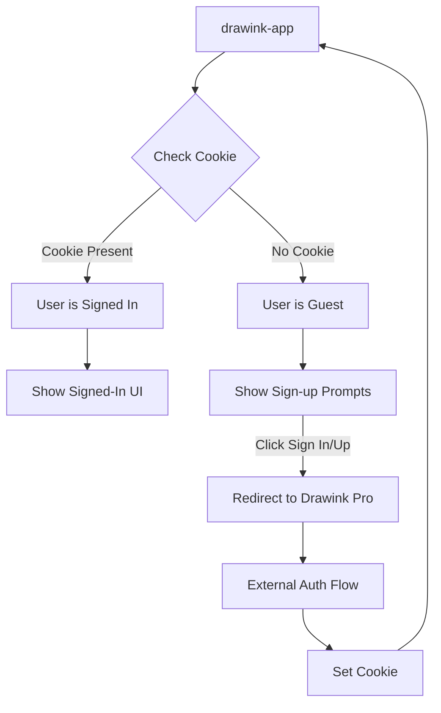

# Drawink App Authentication Guide

This document provides a comprehensive overview of how login and signup flows work in the `drawink-app`.

## Overview

The Drawink app uses a **cookie-based external authentication** system. Authentication is handled externally via **Drawink Pro** (previously Excalidraw+), and the app checks for the presence of an authentication cookie to determine the user's signed-in status.

> [!IMPORTANT]
> The app does **not** contain its own authentication UI (login forms, password fields, etc.). Instead, it redirects users to an external authentication service (Drawink Pro) for sign-in/sign-up.

---

## Authentication Architecture



---

## Key Files and Their Roles

### 1. Constants & Cookie Detection

**File:** [app_constants.ts](file:///Users/youhanasheriff/Desktop/Sheriax/projects/drawink/drawink-app/app_constants.ts)

```typescript
export const COOKIES = {
  AUTH_STATE_COOKIE: "excplus-auth",
} as const;

export const isDrawinkPlusSignedUser = document.cookie.includes(
  COOKIES.AUTH_STATE_COOKIE,
);
```

**Purpose:**
- Defines the authentication cookie name (`excplus-auth`)
- `isDrawinkPlusSignedUser` is a boolean that checks if the user is signed in by detecting the presence of the auth cookie

---

### 2. Environment Variables

The app uses environment variables to configure authentication URLs:

| Variable | Purpose |
|----------|---------|
| `VITE_APP_PLUS_LP` | Landing page URL for Drawink Pro |
| `VITE_APP_PLUS_APP` | Main Drawink Pro app URL |
| `VITE_APP_PLUS_EXPORT_PUBLIC_KEY` | Public key for encrypted exports |

**Development Values:** (from `.env.development`)
```
VITE_APP_PLUS_LP=https://plus.excalidraw.com
VITE_APP_PLUS_APP=http://localhost:3000
```

**Production Values:** (from `.env.production`)
```
VITE_APP_PLUS_APP=https://drawink.sheriax.com
```

---

### 3. Sign In/Sign Up UI Components

#### AppMainMenu.tsx

**File:** [AppMainMenu.tsx](file:///Users/youhanasheriff/Desktop/Sheriax/projects/drawink/drawink-app/components/AppMainMenu.tsx)

The main menu contains a (currently commented out) sign-in/sign-up link:

```tsx
{/* <MainMenu.ItemLink
  icon={loginIcon}
  href={`${import.meta.env.VITE_APP_PLUS_APP}${
    isDrawinkPlusSignedUser ? "" : "/sign-up"
  }?utm_source=signin&utm_medium=app&utm_content=hamburger`}
  className="highlighted"
>
  {isDrawinkPlusSignedUser ? "Sign in" : "Sign up"}
</MainMenu.ItemLink> */}
```

**Logic:**
- If user is signed in → Shows "Sign in" (to access dashboard)
- If user is guest → Shows "Sign up" with `/sign-up` appended to URL

---

#### AppWelcomeScreen.tsx

**File:** [AppWelcomeScreen.tsx](file:///Users/youhanasheriff/Desktop/Sheriax/projects/drawink/drawink-app/components/AppWelcomeScreen.tsx)

```tsx
export const AppWelcomeScreen: React.FC<{
  onCollabDialogOpen: () => any;
  isCollabEnabled: boolean;
}> = React.memo((props) => {
  // Uses isDrawinkPlusSignedUser to determine heading content
  if (isDrawinkPlusSignedUser) {
    headingContent = t("welcomeScreen.app.center_heading");
  } else {
    headingContent = t("welcomeScreen.app.center_heading");
  }
  // ...
});
```

The welcome screen also has a (commented out) sign-up link for guests.

---

#### DrawinkPlusPromoBanner.tsx

**File:** [DrawinkPlusPromoBanner.tsx](file:///Users/youhanasheriff/Desktop/Sheriax/projects/drawink/drawink-app/components/DrawinkPlusPromoBanner.tsx)

```tsx
export const DrawinkPlusPromoBanner = ({
  isSignedIn,
}: {
  isSignedIn: boolean;
}) => {
  return null; // Currently disabled, returns null
};
```

This component is designed to show a promotional banner with different links based on sign-in status.

---

### 4. Command Palette Integration

**File:** [App.tsx](file:///Users/youhanasheriff/Desktop/Sheriax/projects/drawink/drawink-app/App.tsx#L766-L801)

The Command Palette includes sign-in/sign-up commands:

```tsx
const DrawinkPlusAppCommand = {
  label: "Sign up",
  category: DEFAULT_CATEGORIES.links,
  predicate: true,
  icon: <div style={{ width: 14 }}>{ExcalLogo}</div>,
  keywords: [
    "drawink",
    "plus",
    "cloud",
    "server",
    "signin",
    "login",
    "signup",
  ],
  perform: () => {
    window.open(
      `${import.meta.env.VITE_APP_PLUS_APP}?utm_source=drawink&utm_medium=app&utm_content=command_palette`,
      "_blank",
    );
  },
};
```

**Command Palette Logic (lines 1103-1110):**
```tsx
...(isDrawinkPlusSignedUser
  ? [
    {
      ...DrawinkPlusAppCommand,
      label: "Sign in / Go to Drawink Pro",
    },
  ]
  : [DrawinkPlusCommand, DrawinkPlusAppCommand]),
```

- **Signed-in users:** See "Sign in / Go to Drawink Pro"
- **Guest users:** See both "Drawink Pro" and "Sign up" options

---

### 5. Export to Drawink Pro

**File:** [ExportToDrawinkPlus.tsx](file:///Users/youhanasheriff/Desktop/Sheriax/projects/drawink/drawink-app/components/ExportToDrawinkPlus.tsx)

This component handles exporting drawings to Drawink Pro:

```typescript
export const exportToDrawinkPlus = async (
  elements: readonly NonDeletedDrawinkElement[],
  appState: Partial<AppState>,
  files: BinaryFiles,
  name: string,
) => {
  const storage = await loadFirebaseStorage();
  const id = `${nanoid(12)}`;
  
  // Encrypt and upload data
  const encryptionKey = (await generateEncryptionKey())!;
  const encryptedData = await encryptData(
    encryptionKey,
    serializeAsJSON(elements, appState, files, "database"),
  );
  
  // Upload to Firebase Storage
  const storageRef = ref(storage, `/migrations/scenes/${id}`);
  await uploadBytes(storageRef, blob, { /* metadata */ });
  
  // Redirect to Drawink Pro with import parameters
  window.open(
    `${import.meta.env.VITE_APP_PLUS_APP}/import?drawink=${id},${encryptionKey}`,
  );
};
```

**Flow:**
1. Encrypt scene data with generated key
2. Upload encrypted blob to Firebase Storage
3. Upload associated files
4. Open Drawink Pro with import URL containing scene ID and encryption key

---

## Authentication Flow Summary

### Sign Up Flow

```
1. User clicks "Sign up" (menu, welcome screen, or command palette)
   ↓
2. Browser navigates to: VITE_APP_PLUS_APP + "/sign-up"
   ↓
3. User completes sign-up on Drawink Pro
   ↓
4. Drawink Pro sets "excplus-auth" cookie
   ↓
5. User returns to drawink-app (cookie detected)
   ↓
6. isDrawinkPlusSignedUser = true
```

### Sign In Flow

```
1. User clicks "Sign in" 
   ↓
2. Browser navigates to: VITE_APP_PLUS_APP
   ↓
3. User logs in on Drawink Pro
   ↓
4. Drawink Pro sets/validates "excplus-auth" cookie
   ↓
5. User returns to drawink-app
   ↓
6. isDrawinkPlusSignedUser = true
```

---

## File Structure

```
drawink-app/
├── app_constants.ts          # Cookie definitions, isDrawinkPlusSignedUser
├── App.tsx                   # Main app, command palette integration
└── components/
    ├── AppMainMenu.tsx       # Main menu with sign-in/up links
    ├── AppWelcomeScreen.tsx  # Welcome screen with sign-up prompts
    ├── DrawinkPlusPromoBanner.tsx  # Promo banner (currently disabled)
    └── ExportToDrawinkPlus.tsx     # Export to Drawink Pro functionality
```

---

## Current Status

> [!NOTE]
> Many authentication UI elements are currently **commented out** in the codebase. The basic infrastructure exists, but the UI components are disabled.

**Active Features:**
- Cookie-based user detection (`isDrawinkPlusSignedUser`)
- Command palette sign-in/sign-up commands
- Export to Drawink Pro functionality

**Disabled Features:**
- Main menu sign-in/sign-up links (commented out)
- Welcome screen sign-up link (commented out)
- Drawink Pro promo banner (returns `null`)

---

## Related Links

- [App.tsx](file:///Users/youhanasheriff/Desktop/Sheriax/projects/drawink/drawink-app/App.tsx)
- [app_constants.ts](file:///Users/youhanasheriff/Desktop/Sheriax/projects/drawink/drawink-app/app_constants.ts)
- [AppMainMenu.tsx](file:///Users/youhanasheriff/Desktop/Sheriax/projects/drawink/drawink-app/components/AppMainMenu.tsx)
- [AppWelcomeScreen.tsx](file:///Users/youhanasheriff/Desktop/Sheriax/projects/drawink/drawink-app/components/AppWelcomeScreen.tsx)
- [ExportToDrawinkPlus.tsx](file:///Users/youhanasheriff/Desktop/Sheriax/projects/drawink/drawink-app/components/ExportToDrawinkPlus.tsx)
