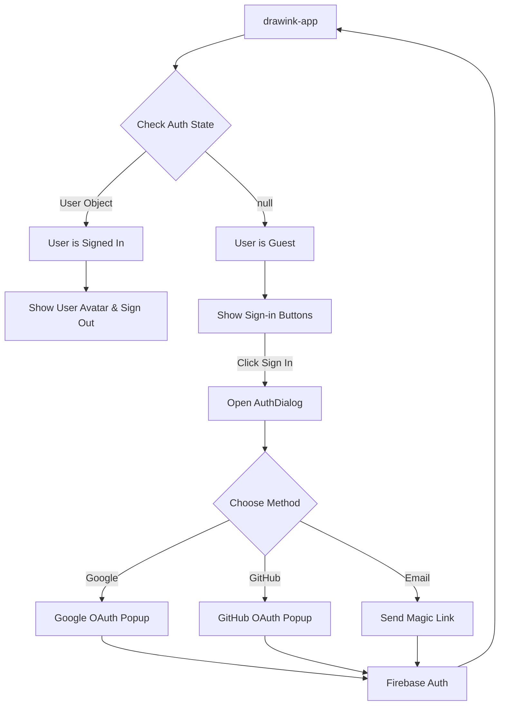

# Drawink App Authentication Guide

This document provides a comprehensive overview of how login and signup flows work in the `drawink-app`.

## Overview

The Drawink app uses **Firebase Authentication** with three sign-in methods:
- **Passwordless Email** - Magic link sent to email
- **Google OAuth** - Sign in with Google popup
- **GitHub OAuth** - Sign in with GitHub popup

---

## Authentication Architecture



---

## Key Files and Their Roles

### 1. Firebase Auth Functions

**File:** [firebase.ts](file:///Users/youhanasheriff/Desktop/Sheriax/projects/drawink/drawink-app/data/firebase.ts)

```typescript
// Sign-in functions
export const signInWithGoogle = async () => { ... };
export const signInWithGithub = async () => { ... };
export const sendEmailSignInLink = async (email: string) => { ... };
export const completeEmailSignIn = async () => { ... };
export const signOut = async () => { ... };
export const onAuthChange = (callback: (user: User | null) => void) => { ... };
```

---

### 2. Auth Module (`drawink-app/auth/`)

| File | Purpose |
|------|---------|
| [authAtom.ts](file:///Users/youhanasheriff/Desktop/Sheriax/projects/drawink/drawink-app/auth/authAtom.ts) | Jotai atoms: `userAtom`, `isAuthenticatedAtom`, `authDialogOpenAtom` |
| [AuthContext.tsx](file:///Users/youhanasheriff/Desktop/Sheriax/projects/drawink/drawink-app/auth/AuthContext.tsx) | AuthProvider with Firebase listener & email link handler |
| [useAuth.ts](file:///Users/youhanasheriff/Desktop/Sheriax/projects/drawink/drawink-app/auth/useAuth.ts) | Hook with auth state and actions |
| [index.ts](file:///Users/youhanasheriff/Desktop/Sheriax/projects/drawink/drawink-app/auth/index.ts) | Module exports |

---

### 3. UI Components

**AuthDialog:** [AuthDialog.tsx](file:///Users/youhanasheriff/Desktop/Sheriax/projects/drawink/drawink-app/components/AuthDialog.tsx)
- Modal with Google/GitHub buttons and email form
- Shows "Check your email" confirmation for passwordless

**UserAvatar:** [UserAvatar.tsx](file:///Users/youhanasheriff/Desktop/Sheriax/projects/drawink/drawink-app/components/UserAvatar.tsx)
- Displays user photo/initials when signed in
- Dropdown with sign-out option

---

### 4. Integration Points

**App.tsx:**
```tsx
<Provider store={appJotaiStore}>
  <AuthProvider>
    <DrawinkWrapper />
    <AuthDialog />
  </AuthProvider>
</Provider>
```

**AppMainMenu.tsx:**
- Shows "Sign in" for guests → opens AuthDialog
- Shows user name + "Sign out" for authenticated users

**AppWelcomeScreen.tsx:**
- Personalized greeting: "Welcome back, {name}!"
- Sign-in link for guests

---

## Firebase Console Setup

> [!IMPORTANT]
> Enable these in [Firebase Console](https://console.firebase.google.com/project/drawink-2026):

1. **Email/Password** → Enable "Email link (passwordless sign-in)"
2. **Google** → Enable and configure
3. **GitHub** → Enable + add OAuth credentials from [GitHub Developer Settings](https://github.com/settings/developers)

---

## Environment Variables

| Variable | Purpose |
|----------|---------|
| `VITE_APP_FIREBASE_CONFIG` | Firebase project configuration JSON |

```json
{
  "apiKey": "...",
  "authDomain": "drawink-2026.firebaseapp.com",
  "projectId": "drawink-2026",
  "storageBucket": "drawink-2026.firebasestorage.app",
  "messagingSenderId": "...",
  "appId": "..."
}
```

---

## Using the Auth Hook

```typescript
import { useAuth } from "../auth";

const MyComponent = () => {
  const {
    user,                // Firebase User object or null
    isAuthenticated,     // boolean
    displayName,         // string - name or email
    avatarUrl,           // string | null
    loading,             // boolean
    error,               // string | null
    signInWithGoogle,    // async function
    signInWithGithub,    // async function
    sendEmailLink,       // async function(email)
    signOut,             // async function
    openAuthDialog,      // function
    closeAuthDialog,     // function
  } = useAuth();
};
```

---

## File Structure

```
drawink-app/
├── auth/
│   ├── authAtom.ts        # Jotai atoms
│   ├── AuthContext.tsx    # Provider component
│   ├── useAuth.ts         # Custom hook
│   └── index.ts           # Exports
├── components/
│   ├── AuthDialog.tsx     # Sign-in modal
│   ├── AuthDialog.scss    # Modal styles
│   ├── UserAvatar.tsx     # Avatar component
│   ├── UserAvatar.scss    # Avatar styles
│   ├── AppMainMenu.tsx    # Menu with auth items
│   ├── AppWelcomeScreen.tsx
│   └── DrawinkPlusPromoBanner.tsx
├── data/
│   └── firebase.ts        # Auth functions
└── App.tsx                # AuthProvider wrapper
```

---

## Related Links

- [firebase.ts](file:///Users/youhanasheriff/Desktop/Sheriax/projects/drawink/drawink-app/data/firebase.ts)
- [AuthDialog.tsx](file:///Users/youhanasheriff/Desktop/Sheriax/projects/drawink/drawink-app/components/AuthDialog.tsx)
- [useAuth.ts](file:///Users/youhanasheriff/Desktop/Sheriax/projects/drawink/drawink-app/auth/useAuth.ts)
- [App.tsx](file:///Users/youhanasheriff/Desktop/Sheriax/projects/drawink/drawink-app/App.tsx)
