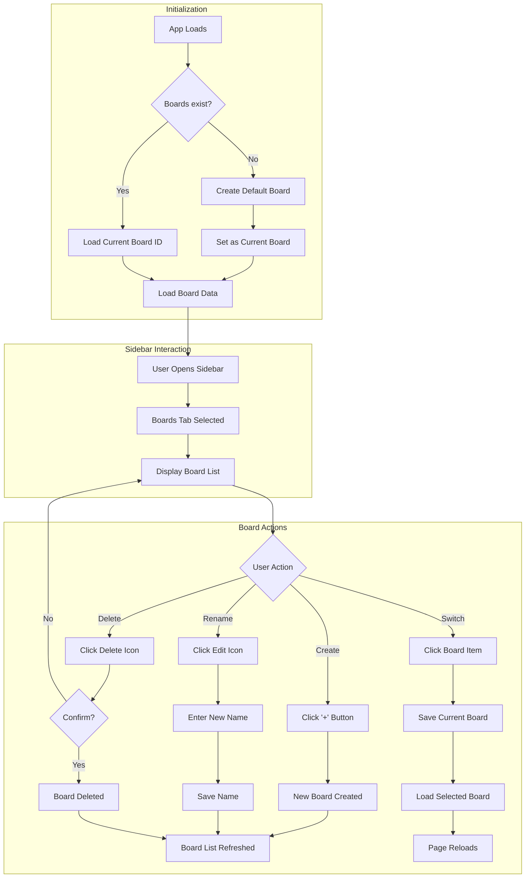

# User Flow: Boards Management in Drawink

This document describes the current user flow for how users interact with boards and how boards are managed in the Drawink application.

---

## 📋 Overview

**Boards** are a feature that allows users to organize their drawings into separate workspaces. Each board contains its own set of elements (drawings) and application state, enabling users to work on multiple projects within the same application.

---

## 🏗️ Architecture

### Core Components

| Component | Location | Purpose |
|-----------|----------|---------|
| `BoardsAPI` | `packages/drawink/types.ts` | Interface defining all board operations |
| `boards.ts` (atoms) | `packages/drawink/atoms/boards.ts` | **Jotai atoms** for board state management |
| `BoardsMenu` | `packages/drawink/components/BoardsMenu.tsx` | UI component for board management |
| `LocalData.boards` | `drawink-app/data/LocalData.ts` | Implementation of board persistence |
| `DefaultSidebar` | `packages/drawink/components/DefaultSidebar.tsx` | Sidebar containing the boards tab |

### State Management (Jotai Atoms)

The board state is managed using **Jotai atoms** for reactive, efficient state management:

```typescript
// Core State Atoms
boardsAPIAtom      // BoardsAPI | null - The API implementation
boardsAtom         // Board[] - List of all boards
currentBoardIdAtom // string | null - Active board ID
isLoadingBoardsAtom // boolean - Loading state
editingBoardIdAtom // string | null - Board being renamed

// Derived Atoms
currentBoardAtom   // Board | null - Computed from boardsAtom + currentBoardIdAtom

// Action Atoms (write-only)
refreshBoardsAtom  // Reload boards from API
createBoardAtom    // Create a new board
switchBoardAtom    // Switch to a different board
updateBoardNameAtom // Rename a board
deleteBoardAtom    // Delete a board
```

### Data Types

```typescript
// Board data structure
interface Board {
  id: string;           // Unique identifier for the board
  name: string;         // Display name of the board
  createdAt: number;    // Timestamp when board was created
  lastModified: number; // Timestamp of last modification
}

// BoardsAPI interface
interface BoardsAPI {
  getBoards: () => Promise<Board[]>;
  createBoard: (name: string) => Promise<string>;
  switchBoard: (id: string) => Promise<void>;
  updateBoardName: (id: string, name: string) => Promise<void>;
  deleteBoard: (id: string) => Promise<void>;
  getCurrentBoardId: () => Promise<string | null>;
}
```

---

## 🔄 User Flow Diagram



---

## 📍 Entry Points

### 1. Sidebar Access

The boards feature is accessed through the **DefaultSidebar** component, which includes a "Boards" tab:

```tsx
// DefaultSidebar.tsx
<Sidebar.TabTrigger tab={BOARDS_SIDEBAR_TAB}>
  {RectangleIcon}
</Sidebar.TabTrigger>

<Sidebar.Tab tab={BOARDS_SIDEBAR_TAB}>
  <BoardsMenu />
</Sidebar.Tab>
```

The sidebar contains three main tabs:
1. **Search** - Canvas search functionality
2. **Boards** - Board management (default tab)
3. **Library** - Element library

---

## 🛠️ User Actions

### 1. Creating a New Board

**Flow:**
1. User opens the sidebar and navigates to the **Boards** tab
2. User clicks the **"+ Create Board"** button
3. A new board is created with an auto-generated name: `"Untitled Board {n}"`
4. The board list refreshes to show the new board

**Code Path:**
```
BoardsMenu.handleCreateBoard()
  → boardsAPI.createBoard(name)
    → LocalData.boards.createBoard(name)
      → localStorage.setItem(STORAGE_KEYS.LOCAL_STORAGE_BOARDS, ...)
  → refreshBoards()
```

**Implementation:**
```typescript
// LocalData.ts
createBoard: async (name: string): Promise<string> => {
  const boards = await LocalData.boards.getBoards();
  const newBoard: Board = {
    id: randomId(),
    name,
    createdAt: Date.now(),
    lastModified: Date.now(),
  };
  boards.push(newBoard);
  localStorage.setItem(STORAGE_KEYS.LOCAL_STORAGE_BOARDS, JSON.stringify(boards));
  return newBoard.id;
}
```

---

### 2. Switching Between Boards

**Flow:**
1. User clicks on a board item in the boards list
2. The current board's data is automatically saved (via `LocalData.save()`)
3. The new board ID is set as the current board
4. **The page reloads** to load the new board's data

**Code Path:**
```
BoardsMenu.handleSwitchBoard(id)
  → boardsAPI.switchBoard(id)
    → localStorage.setItem(LOCAL_STORAGE_CURRENT_BOARD_ID, id)
  → window.location.reload()
```

**Important Note:** Currently, switching boards triggers a **full page reload**. This ensures all data is properly loaded but provides a less smooth user experience.

**Data Isolation:**
Each board stores its data in separate localStorage keys:
- **Elements**: `drawink-board-{boardId}-elements`
- **State**: `drawink-board-{boardId}-state`

---

### 3. Renaming a Board

**Flow:**
1. User hovers over a board item to reveal action buttons
2. User clicks the **edit icon** (pencil)
3. An inline text input appears with the current board name
4. User types the new name and presses **Enter** or clicks the checkmark
5. User can press **Escape** to cancel

**Code Path:**
```
BoardsMenu.startEditing(board)
  → [User edits name in input field]
  → BoardsMenu.saveBoardName(id)
    → boardsAPI.updateBoardName(id, newName)
      → localStorage.setItem(...)
    → refreshBoards()
```

---

### 4. Deleting a Board

**Flow:**
1. User hovers over a board item to reveal action buttons
2. User clicks the **delete icon** (trash)
3. A confirmation dialog appears: `"Are you sure you want to delete this board?"`
4. If confirmed, the board is deleted from the list
5. The board list refreshes

**Constraints:**
- Users **cannot delete the last remaining board** (the delete button is hidden when `boards.length <= 1`)
- Deleted board data (elements/state) is **not automatically cleaned up** from localStorage

**Code Path:**
```
BoardsMenu.handleDeleteBoard(e, id)
  → window.confirm(t("alerts.deleteBoard"))
  → boardsAPI.deleteBoard(id)
    → localStorage.setItem(...)
  → refreshBoards()
```

---

## 💾 Data Persistence

### Storage Keys

| Key | Purpose |
|-----|---------|
| `drawink-boards` | Array of all board metadata |
| `drawink-current-board-id` | ID of the currently active board |
| `drawink-board-{id}-elements` | Elements for a specific board |
| `drawink-board-{id}-state` | App state for a specific board |
| `drawink` (legacy) | Default elements storage |
| `drawink-state` (legacy) | Default state storage |

### Auto-Save Behavior

The application automatically saves the current board's data:

```typescript
// LocalData.ts - saveDataStateToLocalStorage()
const currentBoardId = localStorage.getItem(LOCAL_STORAGE_CURRENT_BOARD_ID);
const elementsKey = currentBoardId
  ? `drawink-board-${currentBoardId}-elements`
  : STORAGE_KEYS.LOCAL_STORAGE_ELEMENTS;
const stateKey = currentBoardId
  ? `drawink-board-${currentBoardId}-state`
  : STORAGE_KEYS.LOCAL_STORAGE_APP_STATE;
```

---

## 🔄 Migration & Initialization

When the app loads for the first time (or when no boards exist), a **default board** is automatically created:

```typescript
// localStorage.ts - importFromLocalStorage()
const boards = localStorage.getItem(STORAGE_KEYS.LOCAL_STORAGE_BOARDS);
if (!boards || JSON.parse(boards).length === 0) {
  const defaultBoard = {
    id: "default",
    name: "Default Board",
    createdAt: Date.now(),
    lastModified: Date.now(),
  };
  localStorage.setItem(STORAGE_KEYS.LOCAL_STORAGE_BOARDS, JSON.stringify([defaultBoard]));
  localStorage.setItem(STORAGE_KEYS.LOCAL_STORAGE_CURRENT_BOARD_ID, defaultBoard.id);
  
  // Migrate existing data to the default board
  if (savedElements) {
    localStorage.setItem(`drawink-board-${defaultBoard.id}-elements`, savedElements);
  }
  if (savedState) {
    localStorage.setItem(`drawink-board-${defaultBoard.id}-state`, savedState);
  }
}
```

---

## 🧩 Atom Integration (Jotai)

The board state is managed using **Jotai atoms** instead of React Context for better reactivity and cleaner architecture.

### Initialization (Host App)

The `BoardsAPI` implementation is initialized via Jotai store before the app renders:

```typescript
// drawink-app/App.tsx
import { boardsAPIAtom } from "@drawink/drawink/atoms/boards";
import { editorJotaiStore } from "@drawink/drawink/editor-jotai";

// Initialize boards API atom before render
editorJotaiStore.set(boardsAPIAtom, LocalData.boards);
```

### Component Usage

Components access board state via Jotai hooks:

```typescript
// packages/drawink/components/BoardsMenu.tsx
import { useAtom, useAtomValue, useSetAtom } from "../editor-jotai";
import {
    boardsAtom,
    currentBoardIdAtom,
    isLoadingBoardsAtom,
    refreshBoardsAtom,
    createBoardAtom,
    switchBoardAtom,
} from "../atoms/boards";

export const BoardsMenu = () => {
    // Read-only state
    const boards = useAtomValue(boardsAtom);
    const currentBoardId = useAtomValue(currentBoardIdAtom);
    const isLoading = useAtomValue(isLoadingBoardsAtom);
    
    // Actions (write-only)
    const refreshBoards = useSetAtom(refreshBoardsAtom);
    const createBoard = useSetAtom(createBoardAtom);
    const switchBoard = useSetAtom(switchBoardAtom);
    
    // ...
};
```

### Board Switching Event

When switching boards, a custom event is dispatched for the host app to handle:

```typescript
// atoms/boards.ts - switchBoardAtom
window.dispatchEvent(
    new CustomEvent("drawink-board-switch", {
        detail: { boardId },
    }),
);
```

---

## 🎨 UI Components

### BoardsMenu Component

The `BoardsMenu` component (`packages/drawink/components/BoardsMenu.tsx`) provides the full UI for board management:

**States:**
- `boards` - Array of all boards
- `currentBoardId` - ID of active board
- `loading` - Loading state
- `editingBoardId` - ID of board being renamed
- `newBoardName` - Temporary name during editing

**Features:**
- Loading spinner while fetching boards
- Create button with "+" icon
- Board list with active state highlighting
- Inline editing for board names
- Hover-reveal action buttons (edit, delete)

---

## ⚠️ Known Limitations

| Limitation | Impact | Priority |
|------------|--------|----------|
| **Page Reload on Switch** | Poor UX - interrupts workflow | 🔴 High |
| **Orphan Data on Delete** | Storage bloat over time | 🟡 Medium |
| **No Board Export/Import** | Can't backup/restore individual boards | 🟢 Low |
| **Cannot Delete Last Board** | UX constraint (intentional) | ⚪ N/A |

### Existing Capabilities (NOT Limitations)

The following features **already exist** in Drawink:

1. **✅ Sharing via Link** - Export current scene to backend and generate shareable links (`exportToBackend`)
2. **✅ Live Collaboration** - Start real-time collaboration sessions with room links (`ShareDialog`, `Collab`)
3. **✅ File Sharing** - Files are encrypted and uploaded to Firebase for sharing

---

## 🔧 Improvement Recommendations

### 1. Eliminate Page Reload on Board Switch (High Priority)

**Current Problem:**
```typescript
// BoardsMenu.tsx - Line 56
window.location.reload(); // Forces full page reload
```

**Root Cause:**
The application state (`elements`, `appState`) is loaded once during initialization via `initialStatePromiseRef`. Switching boards requires reloading this data, but the current architecture doesn't support dynamic scene replacement.

**Recommended Solution:**

#### Option A: Use `drawinkAPI.updateScene()` (Preferred)

Modify `handleSwitchBoard` to load the new board's data and update the scene directly:

```typescript
// BoardsMenu.tsx
const handleSwitchBoard = async (id: string) => {
    if (!boardsAPI || id === currentBoardId) return;
    
    try {
        // 1. Save current board's state first (already happens via onChange)
        LocalData.flushSave();
        
        // 2. Switch the current board ID
        await boardsAPI.switchBoard(id);
        setCurrentBoardId(id);
        
        // 3. Load new board's data from localStorage
        const newBoardData = await loadBoardData(id);
        
        // 4. Update scene without reload
        drawinkAPI.updateScene({
            elements: newBoardData.elements,
            appState: {
                ...newBoardData.appState,
                isLoading: false,
            },
            captureUpdate: CaptureUpdateAction.IMMEDIATELY,
        });
        
        // 5. Load associated files
        if (newBoardData.fileIds.length > 0) {
            const { loadedFiles } = await LocalData.fileStorage.getFiles(newBoardData.fileIds);
            drawinkAPI.addFiles(loadedFiles);
        }
        
    } catch (error) {
        console.error("Failed to switch board", error);
    }
};
```

#### Required Changes:

1. **Pass `drawinkAPI` to `BoardsMenu`**: Currently `BoardsMenu` only has access to `boardsAPI`. Need to also pass `drawinkAPI` via context or props.

2. **Create `loadBoardData` helper in `LocalData.ts`**:
```typescript
static loadBoardData(boardId: string) {
    const elementsKey = `drawink-board-${boardId}-elements`;
    const stateKey = `drawink-board-${boardId}-state`;
    
    const elements = JSON.parse(localStorage.getItem(elementsKey) || '[]');
    const appState = JSON.parse(localStorage.getItem(stateKey) || '{}');
    
    // Extract file IDs for loading
    const fileIds = elements
        .filter((el: any) => el.type === 'image' && el.fileId)
        .map((el: any) => el.fileId);
    
    return { elements, appState, fileIds };
}
```

3. **Ensure proper save before switch**: Call `LocalData.flushSave()` to ensure current data is persisted.

#### Option B: Use Custom Event System

Emit a custom event that App.tsx listens to for board changes:

```typescript
// BoardsMenu.tsx
window.dispatchEvent(new CustomEvent('boardSwitch', { detail: { boardId: id } }));

// App.tsx
useEffect(() => {
    const handleBoardSwitch = async (e: CustomEvent) => {
        const { boardId } = e.detail;
        // Load and update scene...
    };
    window.addEventListener('boardSwitch', handleBoardSwitch);
    return () => window.removeEventListener('boardSwitch', handleBoardSwitch);
}, []);
```

---

### 2. Clean Up Orphan Data on Board Delete (Medium Priority)

**Current Problem:**
When a board is deleted, only the board metadata is removed from `drawink-boards`. The actual board data (`drawink-board-{id}-elements` and `drawink-board-{id}-state`) remains in localStorage.

**Recommended Solution:**

Modify `LocalData.boards.deleteBoard`:

```typescript
// LocalData.ts
deleteBoard: async (id: string): Promise<void> => {
    const boards = await LocalData.boards.getBoards();
    const newBoards = boards.filter((b) => b.id !== id);
    
    // Remove board metadata
    localStorage.setItem(
        STORAGE_KEYS.LOCAL_STORAGE_BOARDS,
        JSON.stringify(newBoards),
    );
    
    // 🆕 Clean up orphan data
    localStorage.removeItem(`drawink-board-${id}-elements`);
    localStorage.removeItem(`drawink-board-${id}-state`);
    
    // 🆕 Optional: Clean up associated files from IndexedDB
    // This would require tracking which files belong to which board
},
```

**Additional Consideration:**
Add a cleanup utility for existing orphan data:

```typescript
static cleanupOrphanBoardData: async () => {
    const boards = await LocalData.boards.getBoards();
    const validBoardIds = new Set(boards.map(b => b.id));
    
    // Find all board-specific keys in localStorage
    for (let i = 0; i < localStorage.length; i++) {
        const key = localStorage.key(i);
        if (key?.startsWith('drawink-board-')) {
            const match = key.match(/drawink-board-([^-]+)/);
            if (match && !validBoardIds.has(match[1])) {
                localStorage.removeItem(key);
            }
        }
    }
}
```

---

### 3. Add Board Export/Import (Low Priority)

**Use Case:** Users want to backup/share specific boards.

**Recommended Solution:**

Leverage existing `serializeAsJSON` and `loadFromBlob` functions:

```typescript
// BoardsMenu.tsx - Add export button
const handleExportBoard = async (boardId: string) => {
    const boardData = LocalData.loadBoardData(boardId);
    const boards = await boardsAPI.getBoards();
    const boardMeta = boards.find(b => b.id === boardId);
    
    const exportData = {
        type: 'drawink-board',
        version: 1,
        board: boardMeta,
        elements: boardData.elements,
        appState: boardData.appState,
    };
    
    // Use existing export utilities
    const blob = new Blob([JSON.stringify(exportData)], { type: 'application/json' });
    const url = URL.createObjectURL(blob);
    
    const a = document.createElement('a');
    a.href = url;
    a.download = `${boardMeta?.name || 'board'}.drawinkboard`;
    a.click();
};

const handleImportBoard = async (file: File) => {
    const text = await file.text();
    const data = JSON.parse(text);
    
    if (data.type !== 'drawink-board') throw new Error('Invalid board file');
    
    // Create new board with imported data
    const newBoardId = await boardsAPI.createBoard(data.board.name);
    
    // Save the imported elements/state
    localStorage.setItem(`drawink-board-${newBoardId}-elements`, JSON.stringify(data.elements));
    localStorage.setItem(`drawink-board-${newBoardId}-state`, JSON.stringify(data.appState));
    
    await refreshBoards();
};
```

---

## 📊 Implementation Priority Matrix

| Feature | Effort | Impact | Priority |
|---------|--------|--------|----------|
| No-reload board switch | Medium | High | 🔴 P1 |
| Orphan data cleanup | Low | Medium | 🟡 P2 |
| Add export icon to board items | Low | Low | 🟢 P3 |
| Add import board button | Low | Low | 🟢 P3 |

---

## 🔗 Integration with Existing Sharing Features

### Current Sharing Flow

The application already supports two sharing mechanisms:

1. **Shareable Links** (`exportToBackend`)
   - Uploads encrypted scene data to backend
   - Generates URL with format: `#json={id},{encryptionKey}`
   - Files uploaded to Firebase: `/files/shareLinks/{id}`

2. **Live Collaboration** (`Collab.tsx`)
   - Creates real-time room via WebSocket
   - Generates URL with format: `#room={roomId},{roomKey}`
   - Supports multiple simultaneous users

### Board + Sharing Integration Ideas

1. **Share Current Board**: Add a "Share Board" button in BoardsMenu that uses existing `exportToBackend`
2. **Import from Link**: Allow importing a shared link as a new board instead of replacing current scene
3. **Collaborative Boards**: Start collaboration session scoped to a specific board
